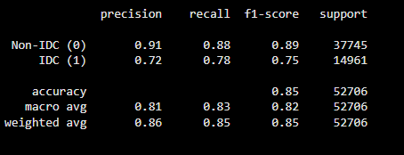
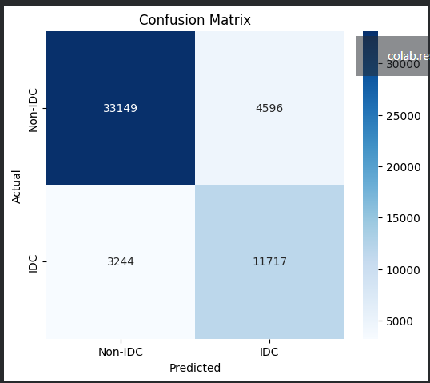
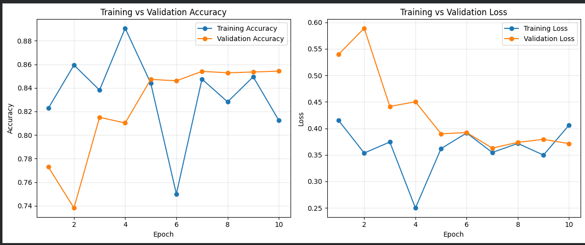

# CancerNet — Breast Cancer Histology Image Classification

A lightweight Convolutional Neural Network (CNN) that classifies breast cancer histopathology image patches as **IDC-positive** (malignant, Invasive Ductal Carcinoma) or **IDC-negative** (benign), built with Keras/TensorFlow and trained on the [IDC_regular](https://www.kaggle.com/datasets/paultimothymooney/breast-histopathology-images) dataset from Kaggle.

## Overview

Invasive Ductal Carcinoma (IDC) is the most common subtype of breast cancer. When pathologists assess a whole-mount tissue sample, one of the first steps is manually identifying the regions that contain IDC — a slow, subjective process. This project trains a CNN ("CancerNet") to automate that first-pass identification at the level of individual 50×50 pixel image patches, as a proof-of-concept decision-support tool.

## Results

| Metric | Value |
|---|---|
| Test Accuracy | **85.13%** |
| Test Loss | 0.3619 |
| Non-IDC F1-score | 0.89 |
| IDC (positive) F1-score | 0.75 |
| IDC (positive) Recall | 78% |
| Best epoch | 7 of 10 (restored via early stopping) |

**Classification report**



**Confusion matrix**



**Training vs. validation curves**



## Dataset

- **Source:** [IDC_regular breast histopathology dataset](https://www.kaggle.com/datasets/paultimothymooney/breast-histopathology-images) (Kaggle)
- **Size:** 277,524 labeled 50×50 pixel patches extracted from 162 whole-mount slide images, scanned at 40x magnification
- **Class balance:** 397,476 IDC-negative (71.6%) / 157,572 IDC-positive (28.4%)
- **Split:** 80% train / 10% validation / 10% test (stratified, `random_state=42`)

The dataset is **not included in this repository** — it's ~3GB and publicly hosted on Kaggle. See [Setup](#setup) below for how to download it.

## Model — CancerNet

A compact CNN (~1.2M parameters) built with `SeparableConv2D` layers, batch normalization, and dropout:

- Input: 50×50×3 RGB patch
- 3 convolutional blocks (32 → 64 → 128 filters), each followed by max pooling and dropout
- Classifier head: Flatten → Dense → BatchNorm → Dropout → Dense (softmax, 2 classes)

Trained with Adagrad, binary cross-entropy loss, class weighting (to address the 72/28 imbalance), data augmentation (rotation/zoom/shift/shear/flip on the training set only), and validation-based early stopping with checkpointing.

## Repository Structure

```
.
├── CancerNet.ipynb          # Full notebook: data prep, model, training, evaluation
├── requirements.txt         # Python dependencies
├── results/                 # Saved output screenshots (curves, confusion matrix, report)
├── LICENSE
└── README.md
```
